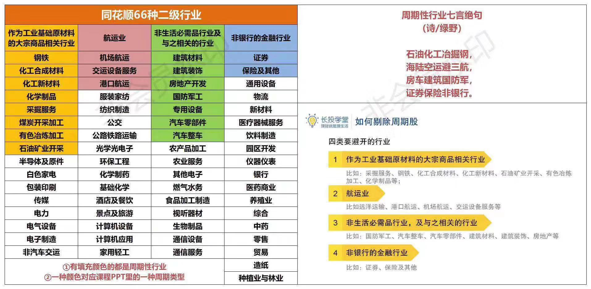

# 股票初级

> 本页笔记已整理，点上方文件夹可以查看原始笔记<br/>[回课程目录](/README.md)

> [课后答疑](/ichangtou/stock/primary/Q%26A.md)

### 目录

+ [第一天 迈出股票投资第一步：找准入市时机](#第一课笔记)

+ [第二天 建立你的投资组合：合理规避风险](#第二课笔记)

+ [第三天 “好公司”投资法：初筛白马股](#第三课笔记)

	- [财报披露时间](#财报披露时间)

+ [第四天 “好公司”投资法：剔除周期股](#第四课笔记)

+ [第五天 “好公司”投资法：剔除基本面转坏的股票](#第五课笔记)

+ [第六天 财务三表分析（1）如何识别收入美化](#第六课笔记)

+ [第七天 财务三表分析（2）如何识别资产美化](#第七课笔记)

+ [第八天 财务三表分析（3）自由现金流的重要性](#第八课笔记)

+ [第九天 实操：构建你的白马组合](#第九课笔记)

+ [第十天 “捡烟蒂”投资法：便宜组合](#第十课笔记)

+ [第十一天 “捡烟蒂”投资法：便宜组合实操构建](#第十一课笔记)

+ [第十二天 实战：第一次“下注”买股票](#第十二课笔记)

+ 第十三天 股海沉浮．锦囊妙计

-------------------------

# 第一课笔记

#### 2019-10-21

## 股市投资流派

### 价值投资派

关注公司内在价值，关注公司目前是否有足够低的价格

重点是看懂公司目前的价值，进行低买高卖

+ 捡烟蒂投资法

	> 找到目前不被关注且估价较低的好公司，因为这类公司估价已经比较低，所以下跌空间比上涨空间小的多，只要市场恢复对其的关注，就可以赚钱

	- 股票的背后是公司，要学会分析公司的价值

	- 投资要留后手以降低风险

+ 好公司投资法

	> 好公司的价值最终会体现在估价上，在价格较低时购入股票并在估价上涨后卖出

### 成长投资派

关注公司内在价值，关注公司未来是否有足够高的增长率

重点是找到刚起步，未来会腾飞的公司

### 技术投资派

通过分析股票价格走势，预测未来涨跌

### 宏观投资派

经济市场与股票市场正相关，研究国家经济以此指导投资

### 有效市场派

相信市场对股票的定价，重点研究内幕消息

## “天时、地利、人和”

### “天时”

找准入市时机，在股票便宜的时候买入，价格高时卖出

### “地利”

合理构建投资组合

### “人和”

学会建设过硬的心理素质

## “天时”

+ 溢价：相对公司内在价值，其股价高于价值

+ 折价：相对公司内在价值，其股价低于价值

公司的价值 = 公司目前的价值 + 公司未来能赚取的价值

### 估值指标

#### 指标解析

+ 市盈率（PE）

	> 简单理解：把公司买下来后多少年能回本

	- `PE = 市值 / 净利润`

+ 市净率（PB）

	> 简单理解：公司自有资产的占比

	- `PB = 市值 / 净资产`

#### 入市时机

```
(沪深300PE !> 沪深300PE十年内分位点50%) && (沪深300PB !> 沪深300PB十年内分位点20%)
          or
(中证500PE !> 中证500PE十年内分位点50%) && (中证500PB !> 中证500PB十年内分位点20%)
```

-------------------------

# 第二课笔记

#### 2019-10-22

## 风险的分类

+ 系统性风险

	> 通过先估值再入市可以一定程度上规避开

	- 政策风险

		> 政策风险：政策忽然巨变影响企业生存

	- 利率风险

		> 市场利率不断波动造成收益不确定性

	- 购买力风险

		> 通货膨胀

+ 非系统性风险（个股的风险）

	- 经营风险

		> 公司错误的决策可能使公司市值迅速下滑

	- 信用风险

		> 公司违背信用造成的风险

	- 道德风险

		> 公司违背社会道德经营被曝光，短时间内严重影响公司市值和股价

## 规避系统性风险

> 投资时分散投资的股票及其所属行业，可以增加抗风险能力

对于一般人，持有**4~8**只股票是合理的选择，既不会需要大量的时间和资金进行管理，且可以规避大部分系统性风险。

同一行业的股票在配置占比中，*不应*超过总资金量的**30%**。

-------------------------

# 第三课笔记

#### 2019-10-23

## 投资回报率

> `投资回报率 = (卖出价格 / 买入价格 - 1) * 100%`

> `复合年化收益率 = ((卖出价格 / 买入价格) ^ (1 / 持有年限)) - 1) * 100%`

投资股票的本质是投资一个公司

+ 简单解释：

	从长期看，股票的收益跟公司的收益息息相关，如果公司的盈利一直是资本的6%，那么最终股票的收益会跟6%看齐。

### ROE (净资产收益率)

> `ROE = 净利润 / 净资产`

投资股票的期望收益率约为<strong>>= 15%</strong>，所以ROE应该找<strong>连续7年 >= 15%</strong>的公司为宜。

因财报有披露会略晚与自然季度及年度，筛选时应注意财报披露时间

#### 财报披露时间

季度|公布时间|统计区间
----|----|----
一季度|4/1 ~ 4/30|1/1 ~ 3/31 共**3**个月
二季度|7/1 ~ 8/30|1/1 ~ 6/30 共**6**个月
三季度|10/1 ~ 10/30|1/1 ~ 9/30 共**9**个月
年报|次年1/1 ~ 4/30|1/1 ~ 12/31 共**全年**<br/>必须在**次年一季度**财报披露**前**披露

-------------------------

# 第四课笔记

#### 2019-10-24

## 周期股

### 定义和成因

公司收益跟*经济周期*<strong>强相关</strong>的公司股票即为周期股

所有行业都会被经济周期影响，但并非所有行业都会被*强烈*影响

周期股多为非生活必需品、贸易、工业原材料开采和加工行业

因为一个经济周期的时间跨度很可能<strong>>7年</strong>，所以假如只用ROE<strong>连续7年 >= 15%</strong>的指标筛选，筛选出来的结果会包含周期股；或者公司上市时间短历史数据不足造成误判所致

### 周期性行业

+ 工业基础原料及大宗商品相关行业

	- 工业采掘、金属冶炼、化工原料等

+ 航运及相关行业

+ 非生活必需品及相关行业

+ 非银行的金融业

	- 券商、保险等

### 应对

筛选个股时，应该注意个股所属的行业，尽量剔除周期股

### i问财二级行业中的周期性行业



-------------------------

# 第五课笔记

#### 2019-10-25

### 剔除基本面转坏的股票

新手应尽早从组合里剔除有业绩下滑迹象的公司个股

以下四个指标任一出现负数，即可从组合中剔除之

## 营收增长率（营业收入增长率）

> `营业增长率 = (本年度营业收入 - 上年度营业收入) / 上年度营业收入`<br/>`季度营收增长率 = (本季度营业收入 - 上年同季度营业收入) / 上年同季度营业收入`

## 净利润增长率

> `年度净利润增长率 = (本年度净利润 - 上年度净利润) / 上年度净利润`<br/>`季度净利润增长率 = (本季度净利润 - 上年同季度净利润) / 上年同季度净利润`

-------------------------

# 第六课笔记

#### 2019-10-26

### 小熊定理一：连续两年*应收账款*上升幅度*大于*营业收入上升幅度，则需要警惕

### 财报三表概述

+ 利润表（损益表）

  > 体现公司在一段时间内是盈还是亏

  + 包含*营业收入*

    > 指卖出产品收到的钱，体现赚钱能力，反映公司在一段时间内是盈还是亏

+ 资产负债表

  > 记录了某一时间点，公司的资产（钱财、物品等）及负债

  + 包含*应收账款*

+ 现金流量表

  > 记录了公司的资金出入帐务

以上三表根据统计时间不同，还分为季度报表、半年报表和年度报表

### 利润表详解

#### 名词概念解析

+ 营业收入 ⇔ 利润表（损益表）

  > 预收账款，*不算*收入（已收货款，未交付货物）

+ 应收账款 ⇔ 资产负债表
  > *计入*收入（已交付货物，未收货款）

  > 应该收账款一直在增长的财报应该当心是否存在真货假卖的现象

+ 营业成本

    > 公司用于购买生产资料的支出，包含：管理费用、销售费用、财务费用

#### 实操注意事项

+ 分析财报时因为要跟往年对比，而实际运营中，公司可能会出现偶尔一年营收账款上涨的情况，为了排除这种情况，则需要**至少4年**的数据作为分析对象

+ **银行股不适合使用此方法**

#### 到第六课为止，i问财的搜索条件

```
2012年到2018年ROE>=15%，2019年3季度ROE>=11.25%，行业，上市时间大于5年，2019年9月30日应收增长率，2018年应收增长率，2019年9月30日净利润增长率，2018年净利润增长率
```

-------------------------

# 第七课笔记

#### 2019-10-27

#### 小熊定理二：连续*2年*存货增长率*大于*营业收入率，这家公司的存货可能有问题

#### 小熊定理三：如果一家公司流动负债*远大于*流动资产，说明这家公司已经非常接近破产

## 资产负债表

### 钱的去向

+ 资产投资

  - 货币资金

  - 应收账款

  - 存货

  - 预付款项

  - 固定资产

+ 处理债务

  - 应付账款

  - 短期借款

  - 长期借款

+ 公司实际的净资产（aka: 所有者权益）

### 实际应用

定理二：

1. 从理杏仁可以找到一个公司的利润表和资产负债表

2. 然后分别算出营业收入近3年的增长额 `= 往年增长额 - 今年增长额`

3. 在用得到的 `存货增长额 - 营业收入增长额`

4. 如果所得结果连续两年都为负数（存货增长率比营业收入增长率大），则说明公司存在存货问题

定理三：

1. 从理杏仁找到公司的流动比率

2. 如果 流动比率 `= 流动资产 / 流动负债` < 1，则公司已经出现资不抵债的情况，此时就需要警惕

> 以上两条定理不适用于银行股

-------------------------

# 第八课笔记

#### 2019-10-28

#### 小熊定理四：当一家公司经营活动产生的现金流量净额远大于净利润，说明这家公司可能有隐藏的盈利能力

#### 小熊定理五：自由现金流代表公司真正能自由运用的资金，比净利润更真实，更难作假

## 现金流量表（aka：财务状况变动表）

+ 经营活动产生的现金流量

  - 来自利润表

+ 投资活动产生的现金流量

  - 来自资产负债表，资产的部分

+ 筹资活动现金流量

  - 来自资产负债表，负载的部分

## 自由现金流

自由现金流 `= 经营活动产生的现就流量净额 - 资本开支`

经营活动产生的现就流量净额 `= 所有经营活动收到的现金 - 所有经营活动支付的现金`

资本开支是指现金流量表中的“购建固定资产、无形资产和其他长期资产支付的现金”

-------------------------

# 第九课笔记

#### 2019-10-29

## 快速总结股票初级筛选股票的要点

1. 因为股票的收益最终会与背后的公司的ROE看齐，所以首先要找到ROE连续7年>=15%的公司

2. 根据筛选到的结果，进一步检查这些公司所属的行业，剔除周期股

3. 通过分析财报找到基本面转坏的股票（业绩下滑）

4. 再通过分析财报，排除掉财报“造假”的公司

3. 最后通过财报分析再度确认股票时候具有较好的竞争力，优先选择有较好竞争力的公司

## 股票价格与价值的关系

1. 股票的价值并不能只看价格去判断，要根据公司的价值再参考目前的价格，才可以准确地判断高低

2. 便宜的股票是指PE和PB都在历分位点50%以下，而PE和PB任意一个指标超过50%都说明这个股票目前是被高估了

3. 之前筛选到的股票用以上估值法判断当前股价是否被溢价，剔除溢价股

4. 剩下的股票则根据行业分散原则合理分配（同一行业不超过30%）

5. 再看资金情况，如果资金不够，尽量选PE和PB分位点更低的股票购入，且平均分配资金

## 股票的卖出

1. 好股票的基本面不会频繁变化，一般建立好组合后每年关注一次就好

2. 分析过后将不符合选股条件的股票卖出，将符合的股票纳入组合即可

## 心态建设

+ 投资股票不是买彩票，不会出现一夜暴富的情况，注意个人心理建设，稳住心态长期持有

-------------------------

# 第十课笔记

#### 2019-10-30

## 便宜组合

一般来说好股票买的人多，会导致股价被抬升，资金不足的人难以做白马组合投资

“捡烟蒂”旨在投资目前不被关注但有前景的公司，期望在将来市场恢复对其关注时获利

低市盈率和低市净率指数，通常包含大量亏损股和垃圾股，在两个指数中选择尽量优秀的，可以轻松获得比指数收益率更高的收益率

**选股指标**：`(0 < PE < 10) && (0 < PB < 1.5) && 股息率 > 3%`

### 股息率

> `股息率 = 每股现金分红 / 股价`

股息率代表的是公司是否愿意给股东分红，而A股市场平均股息率是3%，所以筛选烟蒂股时股息率要*至少*<strong>>=3%</strong>为宜

### 实际筛选

理杏仁 ➤ 选股 ➤ 基本面选股 ➤ A股市场 && 沪深两市 ➤ 基本指标 ➤ 选取以下指标：<br/><ul><li>PE-TTM(扣除非经常性损益) </li><li>PB(不含商誉)</li><li>PB(不含商誉)分位点(10年)</li><li>股价</li></ul>➤ 填入筛选数据区间 ➤ 开始选股

+ PE-TTM(扣除非经常性损益)

  > 非经常性损益代表的事偶然产生的营业收入，所以在筛选的时候要注意选择扣除非经常性损益的PE-TTM

+ PB(不含商誉)

  > 公司被收购时，*超过*该公司**净资产**的部分，被称为商誉<br/>净资产里商誉太多，会造成公司被低估的假象，<br/>所以筛选烟蒂股时要注意去除商誉的影响

又有，如果烟蒂股筛选结果越多，说明目前市场整体越被低估，如果筛选出的烟蒂股越少，则说目前市场整体越火爆

-------------------------

# 第十一课笔记

#### 2019-10-31

## 筛选及组合办法

1. 计算从理杏仁中导出的数据

  + 使用`RANK.EQ`计算 *PB(不含商誉)*、*PE-TTM(扣非)* 和*股息率*的排名

  + 然后将他们的排名相加，*升序* 排列，挑选总排名靠前的

2. 按照总排名挑选**8 ~ 10**只股票

  + 要注意行业要分散，同一个行业不宜超过总资金的30%

  + 参考*PB(不含商誉)分位点(10年) %*，<br/>挑选分位点<strong>< 20%</strong>的股票，因为它们目前被低估的可能性更大，<br/>若分位点<strong>> 50%</strong>，则目前估计比较高，不适合买入

3. 参看筛选出的股票中最高价格的个股，计算买一手需要的金额，然后组合中剩下的个股用接近数量的资金购入即可

4. 每隔**半年**重新筛选一次该组合，剔除不符合条件的，纳入符合条件的新个股

  + 频繁操作是大忌，放宽心态长期持有

## Excel函数解释

### 说明

返回一列数字的数字排位。 其大小与列表中其他值相关；如果多个值具有相同的排位，则返回该组值的最高排位。

如果要对列表进行排序，则数字排位可作为其位置。

### 语法

`RANK.EQ(number,ref,[order])`

`RANK.EQ` 函数语法具有下列参数：

参数|是否必选|解析
----|----|----
`Number`|必需|要找到其排位的数字。
`Ref`|必需|数字列表的数组，对数字列表的引用。 Ref 中的非数字值会被忽略。
`Order`|可选|一个指定数字排位方式的数字。

### 备注

如果 Order 为 0（零）或省略，Excel 对数字的排位是基于 Ref 为按降序排列的列表。

如果 Order 不为零， Excel 对数字的排位是基于 Ref 为按照升序排列的列表。

`RANK.EQ` 赋予重复数相同的排位。 但重复数的存在将影响后续数值的排位。 例如，在按升序排序的整数列表中，如果数字 10 出现两次，且其排位为 5，则 11 的排位为 7（**没有**排位为 6 的数值）。

-------------------------

# 第十二课笔记

#### 2019-11-01

## 股票交易规则

### 交易时间

+ 股票的交易时间为周六日以及法定节假日外的工作日

+ 工作日开市时间为 `09:30 - 11:30 AM; 01:00 - 03:00 PM` 每天共计4小时

### 交易单位

+ 买入必须以<strong>“手”</strong>为单位，`1手 = 100股`

+ 不足1手称为<strong>“零股”</strong>，交易或分红可能产生零股<br/>零股**不能**自动合并成整手，如果卖出，将会一次性卖出

### 费用

+ 印花税：买入不收取，卖出成交时收取，为单向收费，收费方是国家税务局

+ 过户费：成交金额的**0.02‰**，买入卖出均需收取，为双向收费，收费方是中国证券登记结算公司

+ 佣金：一般为**3‱**，最高收费*3%*，不足5元按最低**5元**收取，收费方是证券交易公司

### 交易方式

+ 限价委托

  - 投资者自己指定期望价格与数量，当出现期望价格时即可成交，<br/>若当天没有出现委托价格，则无法成交，委托会在收市时*自动撤销*

+ 市价委托

  - 投资者只能指定期望数量，价格以当时的市价为准，市价委托优先与限价委托<br/>但相对限价委托来说，成本会更高，但可以保证**及时**成交

+ 交易时间频率限制

	- 交易频率是*T+1*，当天买入的股票要次日才能卖出<br/>卖出股票的所得的资金，不能当天提现，需要*T+1*日才能提现

## 补充

1. **涨跌停制度**

	+ 股价上涨和下跌幅度只能是上一个交易日收盘价的**10%**

	+ ST(收到过退市警告)开头的股票此限制是**5%**

	+ 新股首日上市，股价不受10%限制，但最高**涨幅**不能超过发行价的**44%**

	> A股的独有特色，限价委托时应注意委托价格是否在涨跌停限价内，如果超出限制，则委托不可能成交，是无效委托

2. **K线图**
+ 若单位时间内，开盘价低于收盘价，则以红色绘制，反之则以绿色绘制

+ 中间实体的上下边沿代表单位时间内开盘价与收盘价

+ 中间的线条顶端代表单位时间内的最高价与最低价，称为上下影线
